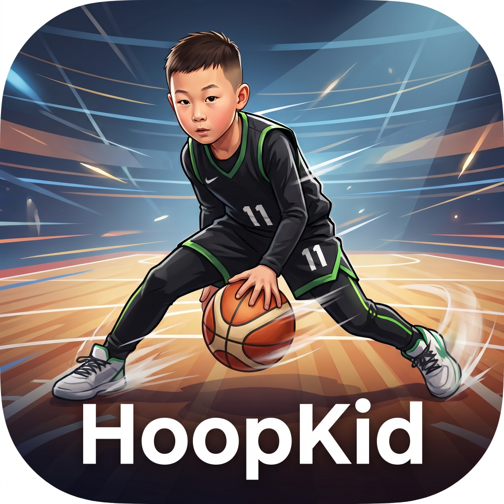
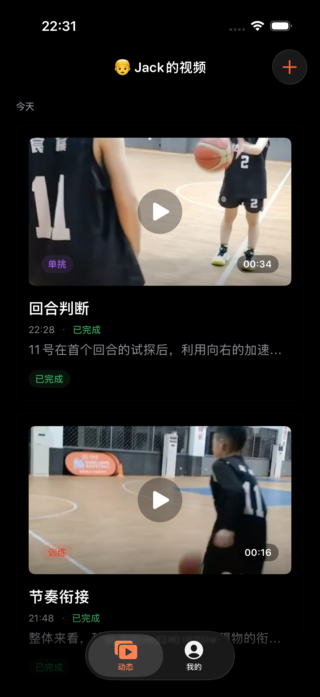
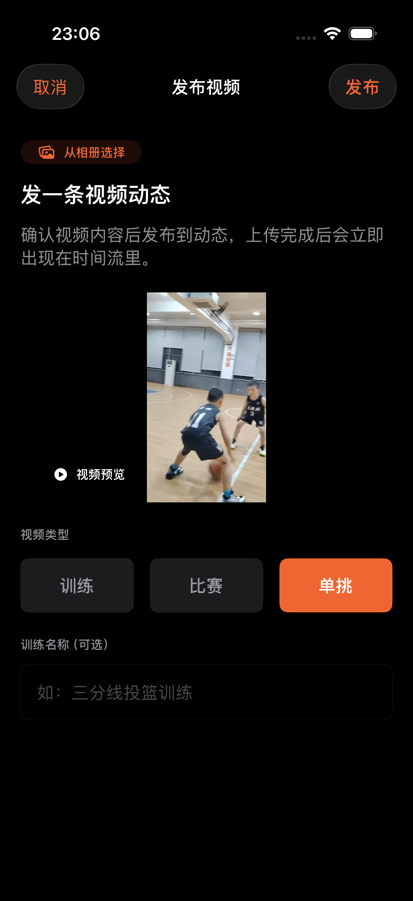
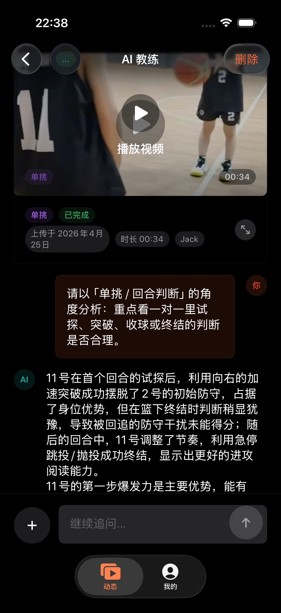

<p align="center">
  
</p>

<h1 align="center">Hoop</h1>

<p align="center">
  用 AI 陪孩子看懂每一条篮球训练视频
</p>

<p align="center">
  
  
  
  
</p>

---

## 这是什么

家长拍了孩子的篮球训练、比赛和单挑视频，却很难看懂细节——这个动作哪里不规范？这次突破为什么没甩开防守？投篮没进是手型还是节奏问题？

Hoop 想解决这个问题：**让每条视频都能被 AI 认真看一遍，并变成可追问的成长记录。**

不只是存档，而是：

- AI 看完视频，给出动作、节奏、决策等维度的专项反馈
- 家长和孩子可以继续追问，像跟教练复盘一样
- 一条条积累，形成孩子自己的成长时间线

---

## 界面预览

<p align="center">
  
  &nbsp;&nbsp;
  
  &nbsp;&nbsp;
  
</p>

<p align="center">
  <sub>左：成长时间线 &nbsp;｜&nbsp; 中：上传视频并选类型 &nbsp;｜&nbsp; 右：AI 教练多轮追问</sub>
</p>

---

## 核心功能

**三类视频，各有策略**

上传时区分训练、比赛、单挑，AI 分析会根据类型采用不同的分析角度：

- **训练**：关注动作链条、发力顺序、重复稳定性
- **比赛**：关注回合决策、时机、空间利用
- **单挑**：关注一对一试探、变速、对位脚步

**AI 教练，可以持续追问**

不是一次性总结——可以围绕同一条视频选不同分析维度，或者继续追问细节，像和教练复盘一样来回沟通。

**家庭多角色**

支持管理员（家长）+ 球员（孩子）两种角色。家长看全局，孩子看自己的记录；数据按成员隔离，切换身份清晰明确。

**成长时间线**

每条视频上传后自动进入时间线，AI 分析摘要直接显示在卡片上，随时翻回来看进步轨迹。

---

## 技术栈

| 层级 | 技术 |
|------|------|
| 语言 / UI | Swift 6 + SwiftUI |
| 本地存储 | SwiftData |
| 视频存储 | 阿里云 OSS（alibabacloud-oss-swift-sdk-v2） |
| AI 分析 | DashScope Qwen 视频理解模型（qwen3.6-plus） |
| 后端 | 无（本地优先，数据存设备本地） |

---

## 项目结构

```
Hoop/
├── App/            # 应用入口（HoopApp、AppView）
├── Core/
│   ├── Configuration/  # 配置加载（OSS、AI、认证）
│   ├── DesignSystem/   # 主题、颜色、字体、间距等 Token
│   └── Services/       # AI 分析、OSS 上传、视频预览服务
└── Features/
    ├── Auth/       # 设备认证（xcconfig 密码锁）
    ├── Users/      # 家庭成员管理（角色、Profile 切换）
    ├── Shell/      # 主导航 TabView
    ├── Home/       # 成长时间线首页
    ├── Training/   # 视频上传与管理
    └── Feed/       # 视频详情 + AI 教练会话

Config/
└── Secrets.xcconfig    # 本地密钥（不进 Git）
```

---

## 本地启动

### 前置条件

- macOS + Xcode（支持 iOS 17+）
- 阿里云 OSS bucket（用于存储视频文件）
- DashScope API Key（用于 AI 视频分析）

### 步骤

**1. 克隆仓库**

```bash
git clone <repo-url>
cd Hoop
```

**2. 创建配置文件**

```bash
cp Config/Secrets.xcconfig.example Config/Secrets.xcconfig
```

编辑 `Config/Secrets.xcconfig`，填入你的配置：

```
# 设备解锁密码（随便设置，用于进入 App）
AUTH_EMAIL = your@email.com
AUTH_PASSWORD = yourpassword

# AI 分析（必填）
DASHSCOPE_API_KEY = sk-xxxx

# OSS 存储（必填）
OSS_ACCESS_KEY_ID = xxxx
OSS_ACCESS_KEY_SECRET = xxxx
OSS_BUCKET = your-bucket
OSS_ENDPOINT = oss-cn-hangzhou.aliyuncs.com
OSS_REGION = cn-hangzhou
```

> **DashScope API Key** 申请：[阿里云百炼平台](https://bailian.console.aliyun.com/)
>
> **OSS** 建议使用 RAM 子账号，仅授予 `oss:PutObject` / `oss:GetObject` 最小权限

**3. 在 Xcode 中打开并运行**

```bash
open Hoop.xcodeproj
```

选择模拟器或真机，按 `⌘R` 运行。

首次启动时输入配置中设置的密码解锁设备 → 创建第一个家庭成员 → 即可开始上传视频并体验 AI 分析。

---

## 认证与角色

```
App 启动
  └── 输入设备密码（Secrets.xcconfig 中设置）
        └── 选择家庭成员（首次使用时创建）
              └── 进入主界面
```

| 角色 | 权限 |
|------|------|
| 管理员（家长） | 查看全部成员数据、管理成员列表、访问设置 |
| 球员（孩子） | 上传视频、查看自己的训练记录和 AI 分析 |

---

## 开发与验证

```bash
# 构建 + 启动模拟器 + 自动截图验收
bash scripts/build-and-launch.sh
```

代码规范参考 [AGENTS.md](AGENTS.md)：改动前先读现有代码，保持改动小而集中，优先简单修复而非新抽象。

---

## 未来计划

- [ ] Supabase 后端集成（STS 替代 OSS 直连，提升密钥安全性）
- [ ] 更完整的成长统计与阶段对比视图
- [ ] 推荐追问问题的智能优化
- [ ] 多孩子家庭的数据汇总与横向对比

---

## 背景

这个项目的起点是一个很真实的问题：家里有大量孩子的篮球视频，但家长几乎看不懂细节，也没有时间把每条视频发给教练询问。

现在视频理解模型能直接看视频，可以做到"每条训练视频都被认真看一遍"。Hoop 就是在这个基础上做的：让 AI 分析视频，让家长和孩子可以继续追问，让这些视频变成真正有用的成长记录。

作者是前端开发背景，这也是一次用 AI 辅助快速进入 iOS 陌生技术栈的实践记录。详细过程见 [docs/intro.md](docs/intro.md)。
